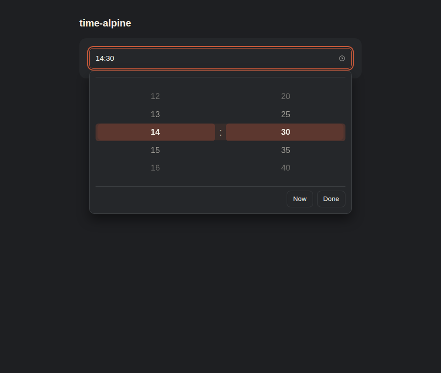
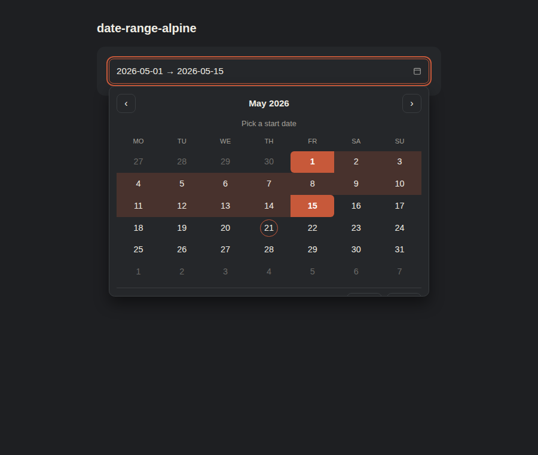
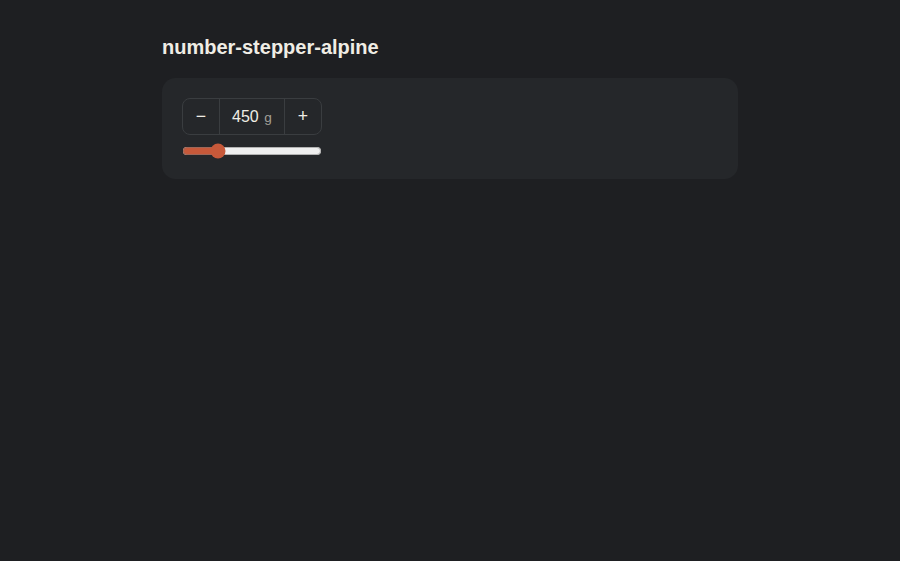
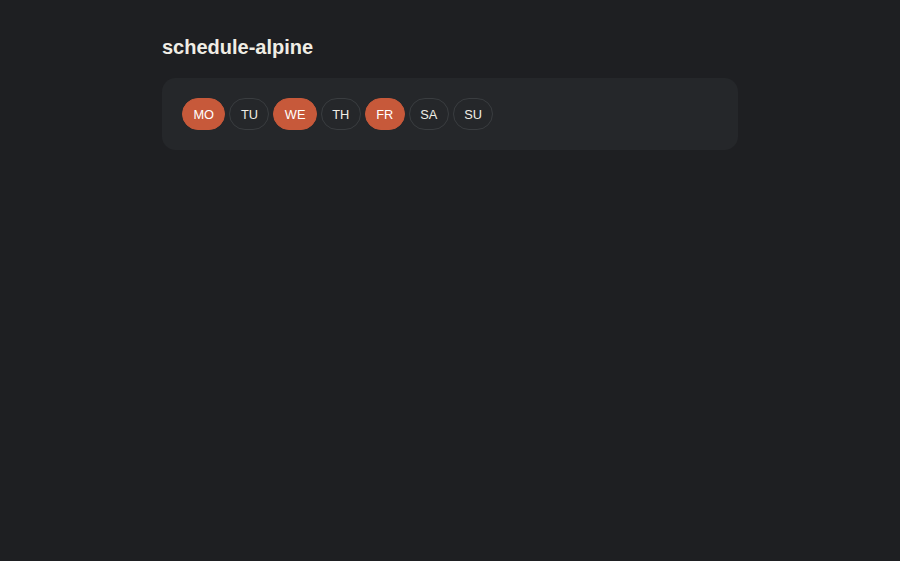
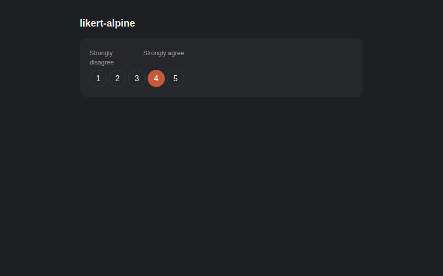
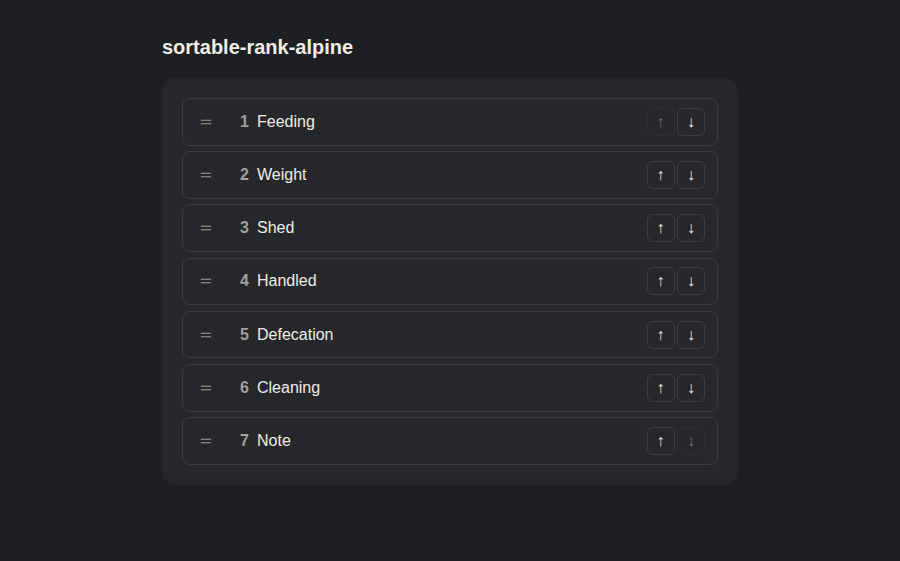
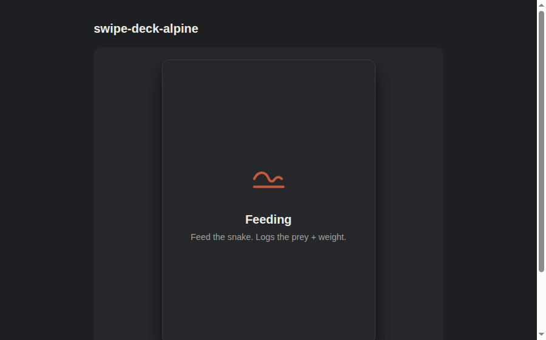
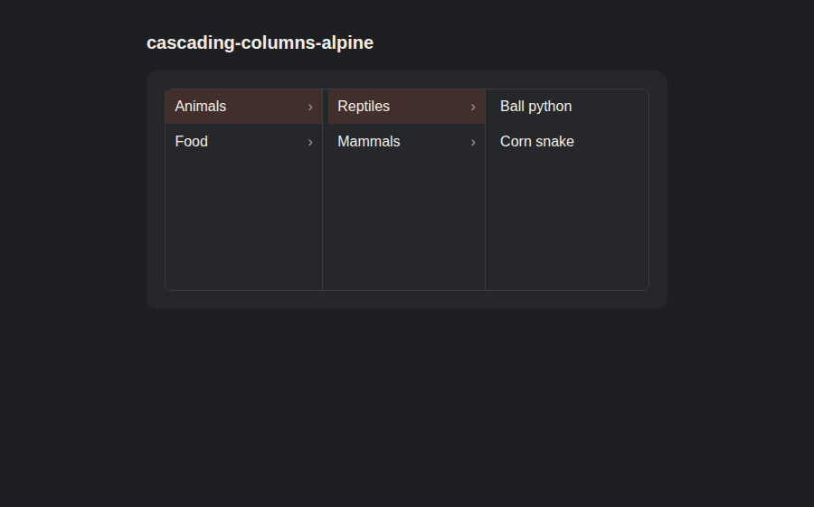
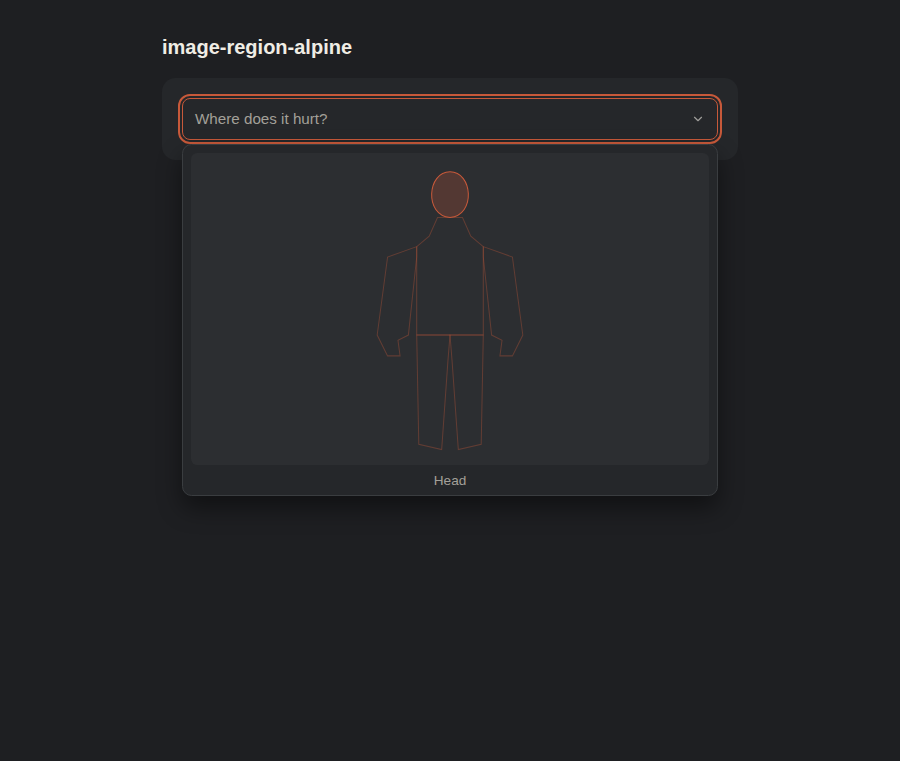

# logged-cloud/select

A family of accessible select widgets for Laravel apps. Each component name spells out behaviour + driver so you can pick the right one without reading the docs.

## Variants

| Component | Preview | Search | Multi | Pattern |
| --- | --- | --- | --- | --- |
| [`searchable-alpine`](#x-selectsearchable-alpine) |  | ✓ client | — | dropdown · combobox + listbox |
| [`multi-alpine`](#x-selectmulti-alpine) |  | ✓ client | ✓ chips | dropdown · combobox + multiselectable listbox |
| [`radio-grid-alpine`](#x-selectradio-grid-alpine) |  | — | — | compact card grid · radiogroup |
| [`radio-list-alpine`](#x-selectradio-list-alpine) |  | — | — | vertical list · radiogroup |
| [`multi-grid-alpine`](#x-selectmulti-grid-alpine) |  | — | ✓ checks | compact card grid · toggle-button group |
| [`multi-list-alpine`](#x-selectmulti-list-alpine) |  | — | ✓ checks | vertical list · toggle-button group |
| [`inline-buttons-alpine`](#x-selectinline-buttons-alpine) |  | — | — | segmented pill row · radiogroup |
| [`card-single-alpine`](#x-selectcard-single-alpine) |  | — | — | big visual cards · radiogroup |
| [`card-multi-alpine`](#x-selectcard-multi-alpine) |  | — | ✓ | big visual cards · toggle-button group |
| [`tags-alpine`](#x-selecttags-alpine) |  | ✓ client | ✓ chips | free-form tag entry · combobox + listbox |
| `searchable-alpine` + `:search-url` |  | ✓ remote | — | same component, debounced server-side search |
| `card-single-alpine` + `:page-size` |  | — | — | same component, prev/next pagination |
| `searchable-alpine` + `:depends-on` |  | ✓ scoped | — | child select gated + scoped by a parent field |
| [`map-svg-alpine`](#x-selectmap-svg-alpine) (world) |  | — | — | SVG map menu · click a country |
| `map-svg-alpine` (country detail) |  | — | — | UK outline + city points |
| `map-svg-alpine` drilldown |  | — | — | world → country → town via `depends-on` |
| [`map-drilldown-alpine`](#x-selectmap-drilldown-alpine) |  | — | — | single trigger, menu swaps as user drills in |
| [`tree-alpine`](#x-selecttree-alpine) |  | — | — | hierarchical list · expand/collapse, roving tabindex |
| [`rating-alpine`](#x-selectrating-alpine) |  | — | — | star rating · role=slider, half-step + clear |
| [`color-palette-alpine`](#x-selectcolor-palette-alpine) |  | — | — | swatch grid · arrow keys wrap by columns |
| [`map-pin-alpine`](#x-selectmap-pin-alpine) |  | — | — | click anywhere on a map to drop a pin |
| [`date-alpine`](#x-selectdate-alpine) |  | — | — | month-grid calendar · WAI grid pattern + min/max |
| [`time-alpine`](#x-selecttime-alpine) |  | — | — | hh:mm scroll columns + Now/Done · 24h or 12h |
| [`date-range-alpine`](#x-selectdate-range-alpine) |  | — | — | start + end picker · in-between shading, auto-swap |
| [`number-stepper-alpine`](#x-selectnumber-stepper-alpine) |  | — | — | ± buttons + slider · role=spinbutton, suffix unit |
| [`schedule-alpine`](#x-selectschedule-alpine) |  | — | — | 7-pill day-of-week toggle · posts as `name[]` |
| [`likert-alpine`](#x-selectlikert-alpine) |  | — | — | 5/7/10-point survey scale · NPS-friendly |
| [`sortable-rank-alpine`](#x-selectsortable-rank-alpine) |  | — | — | drag rows to reorder · captures rank |
| [`swipe-deck-alpine`](#x-selectswipe-deck-alpine) |  | — | — | Tinder-style accept/skip/undo card deck |
| [`cascading-columns-alpine`](#x-selectcascading-columns-alpine) |  | — | — | Finder-style click-into-children columns |
| [`image-region-alpine`](#x-selectimage-region-alpine) |  | — | — | clickable hit regions over any background image |

Naming convention is **`<behaviour>-<driver>`**: behaviour first (`searchable`, `multi`, `radio-grid`, `card-multi`, `tags`, …), driver second (`alpine`, `livewire`, ...). Future entries (`remote-livewire` for server-side search, `native` for a no-JS fallback, …) slot in alongside without forcing a new `composer require`.

## Release notes

The package is on `v3.9`. Highlights, oldest → newest:

- **v2.0–v2.3** · core dropdown family (`searchable`, `multi`, `radio-grid`, `radio-list`, `multi-grid`, `multi-list`, `inline-buttons`, `card-single`, `card-multi`).
- **v2.4** · mobile bottom-sheet, × clear button, `error=""` prop, `tags-alpine` variant.
- **v2.5** · token-aware search ranking + `<mark>` match highlight.
- **v2.6** · debounced `search-url` for remote search, `AbortController`-cancel for stale fetches.
- **v2.7** · R.A.P pass — inline error row, cancel-on-close, tags trim/dedup, accessible-name fallback, `<span>`-not-`<mark>`.
- **v2.8** · memoised filter pipeline + `:render-limit` cap with "showing N of M" footer.
- **v2.9** · final R.A.P round — retry-once on transient 5xx, body-scroll lock on mobile sheet, live-region throttle, collision-proof `lcSafeId`, per-items lowercase WeakMap.
- **v2.10** · card pagination + `:depends-on` parent gating (with `parent` field scoping + `&parent=` URL augmentation).
- **v2.11** · R.A.P on v2.10 — card pager moved outside `role="radiogroup"`, focus follows pager click into the new page, `destroy()` cleanup hook for depends-on listener, live-region announces auto-clear.
- **v3.0** · `map-svg-alpine` + bundled world / UK data (`MapData::world()` / `::uk()` / `::ukTowns()`).
- **v3.1** · UK becomes clickable region polygons (not dots); per-region drilldown datasets.
- **v3.2** · `map-drilldown-alpine` (single trigger, menu swaps as user drills in).
- **v3.3** · `tree-alpine` (recursive children, WAI-ARIA tree, expand/collapse).
- **v3.4** · `rating-alpine` + `color-palette-alpine` + `map-pin-alpine`.
- **v3.5** · `date-alpine` (month-grid calendar, native `<input type=date>` fallback).
- **v3.6** · R.A.P on v3.0-v3.5 — color contrast guard, date arrow-skip-disabled + year-jump, map-pin keyboard placement, rating singular/plural, tree `_parentOf` memo.
- **v3.7** · `time-alpine` + `date-range-alpine` + `number-stepper-alpine` + `schedule-alpine`.
- **v3.8** · `likert-alpine` + `sortable-rank-alpine` + `swipe-deck-alpine` + `cascading-columns-alpine` + `image-region-alpine`.
- **v3.9** · R.A.P on v3.8 — swipe stale-cursor guard + capture release, cascading column-open announce, sortable drag-over announce, image-region keyboard nav, sortable handle `touch-action: none`.


All variants share the same `{key, title, subtitle, svg}` item shape, the same CSS custom-property theming, the same reduced-motion / forced-colours handling, and a built-in `<noscript>` fallback that swaps in a native `<select>` when JavaScript is disabled.

Sister to [logged-cloud/navigation](https://github.com/Logged-Cloud/navigation).

## Requirements

| Dependency | Versions |
| --- | --- |
| PHP | 8.2, 8.3, 8.4 |
| Laravel | 11, 12, 13 (`illuminate/support`) |
| Livewire | 3, 4 (provides the Alpine bundle) |
| Alpine.js | 3 (bundled with Livewire, or load directly) |

## Install

```bash
composer require logged-cloud/select
```

`vendor:publish --tag=select-config` is optional; the components run on sensible defaults out of the box.

If you use Tailwind v4, add the package to your `@source` directives so its classes survive purging:

```css
@source "../../vendor/logged-cloud/select/resources/views";
```

## Item shape (every variant)

| Field | Type | Notes |
| --- | --- | --- |
| `key` | string | Stable identifier the form posts. |
| `title` | string | Bold first line in the row / card. |
| `subtitle` | string | Optional muted second line. |
| `svg` | string | Single SVG `path d` string drawn at 24×24, `stroke=currentColor`. |

Items can be arrays or objects with the matching attribute names. **Order is respected** — components render them in the order you pass them.

---

## `<x-select::searchable-alpine>`


Searchable single-select with a dropdown popup. Items shipped to the page; search runs client-side.

```blade
<x-select::searchable-alpine
    name="prey_type"
    :items="$preyTypes"
    :selected="old('prey_type', $snake->prey_type)"
    placeholder="Pick prey..."
    label="Prey type"
/>
```

| Attribute | Default | Purpose |
| --- | --- | --- |
| `name` | (required) | Form input name. |
| `id` | `Str::camel($label)` or `$name` | Trigger element id. |
| `items` | `[]` | The option list. |
| `selected` | `null` | Pre-selected key. |
| `allow-empty` | `true` | Render the empty row in the menu. |
| `placeholder` | "Select an option" | Trigger text when nothing chosen. |
| `empty-label` | "not set" | Empty row label. |
| `search-label` | "Search..." | Search input placeholder. |
| `no-results-label` | "No options match that." | Empty-search copy. |
| `searchable` | `true` | Show the search input. |
| `icon-size` | `1.75rem` | Row icon tile size. |
| `label` / `labelled-by` | `null` | Accessible name. |
| `required` | `false` | Sets `aria-required` + hidden input required. |
| `disabled` | `false` | Sets `aria-disabled`. |

**Keyboard** — ↑↓ Home/End PageUp/PageDown Esc Tab; Enter / Space picks; typing filters. Opening sends focus to search; picking returns it to the trigger.

---

## `<x-select::multi-alpine>`


Searchable multi-select with chips on the trigger, checkmarks in the menu, hidden inputs posted as `name[]`.

```blade
<x-select::multi-alpine
    name="prey_types"
    :items="$preyTypes"
    :selected="['mouse', 'rat']"
    label="Acceptable prey"
    :max="5"
/>
```

| Extra attribute | Default | Purpose |
| --- | --- | --- |
| `max` | `null` | Cap selections; extras refused with SR-announced "Maximum reached". |
| `chips-limit` | `3` | Above this count the trigger collapses to "N selected". |

`aria-multiselectable="true"` on both the trigger and the listbox. Enter / Space toggles without closing the menu. Each chip has a per-chip × button.

---

## `<x-select::radio-grid-alpine>`


Compact card grid for single-pick where every option should be visible at once (event types, status switchers).

```blade
<x-select::radio-grid-alpine
    name="event_type"
    :items="$eventTypes"
    selected="feeding"
    label="Event type"
    min-width="6.5rem"
/>
```

WAI radio-group roving tabindex. Arrow keys move the selection; Home/End jump to ends; Space/Enter pick the focused card.

---

## `<x-select::radio-list-alpine>`


Vertical list of radio rows with classic dot indicators. Better than the grid for longer choice lists where reading order matters.

```blade
<x-select::radio-list-alpine
    name="event_type"
    :items="$eventTypes"
    selected="weight"
    label="Event type"
/>
```

Same WAI radiogroup pattern as the grid; ↑↓ move within the list, Home/End jump.

---

## `<x-select::multi-grid-alpine>`


Compact card grid for **multi-select**. Toggle-button semantics (`aria-pressed`), checkmark on each chosen card. Posts as `name[]`.

```blade
<x-select::multi-grid-alpine
    name="event_types"
    :items="$eventTypes"
    :selected="['feeding', 'shed']"
    label="Event types"
    :max="3"
/>
```

---

## `<x-select::multi-list-alpine>`


Vertical list version of the above. Each row carries its own checkbox cell + icon + title + subtitle.

```blade
<x-select::multi-list-alpine
    name="event_types"
    :items="$eventTypes"
    :selected="['feeding', 'weight']"
    label="Event types"
/>
```

---

## `<x-select::inline-buttons-alpine>`


Segmented control / pill row for compact single-pick toolbars. Horizontal layout; the active button gets a raised look.

```blade
<x-select::inline-buttons-alpine
    name="event_type"
    :items="$eventTypes"
    selected="handled"
    label="Event type"
/>
```

WAI radiogroup with ←/→ navigation.

---

## `<x-select::card-single-alpine>`


Big visual cards for single-pick choices where each option deserves room for a description and a prominent icon. Useful for plan pickers, mode switchers, onboarding choices.

```blade
<x-select::card-single-alpine
    name="event_type"
    :items="$cards"
    selected="feeding"
    label="Event type"
    min-width="14rem"
    icon-size="2.5rem"
/>
```

Roving tabindex with four-direction arrow navigation (←↑→↓); Home / End jump to ends.

---

## `<x-select::card-multi-alpine>`


Multi-select version of the cards. Toggle-button semantics, checkmark badge on each chosen card. Posts as `name[]`.

```blade
<x-select::card-multi-alpine
    name="event_types"
    :items="$cards"
    :selected="['feeding', 'shed']"
    label="Event types"
    :max="3"
/>
```

---

## `<x-select::tags-alpine>`


Free-form tag editor. The trigger holds chips + an inline input · type to filter suggestions, **Enter** commits the highlighted suggestion or (with `allow-custom`) the typed string, **Backspace** on an empty input removes the last chip, ↑/↓ navigate suggestions. Posts as `name[]`.

```blade
<x-select::tags-alpine
    name="tags"
    :items="$suggestions"
    :selected="$existing"
    label="Tags"
    placeholder="Add a tag..."
    :max="10"
/>

{{-- Lock entries to the suggestion list (no custom strings): --}}
<x-select::tags-alpine
    name="role"
    :items="$roles"
    :allow-custom="false"
    label="Role"
/>
```

| Prop | Default | Notes |
| --- | --- | --- |
| `allow-custom` | `true` | Set `false` to disallow strings that aren't in `items` (Enter on a non-match becomes a no-op). |
| `max` | `null` | Cap the number of chips. Beyond the cap the screen-reader live region announces "Maximum number of tags reached." |
| `error` | `null` | Red ring + `role="alert"` message + `aria-invalid`. |

---

## `<x-select::map-svg-alpine>`


SVG map picker. Menu content is an `<svg>` with each item as a clickable `<path>` (polygon) or `<circle>` (point). Same trigger / open-close / a11y pattern as the dropdown family.

```blade
{{-- Bundled dataset shortcut --}}
<x-select::map-svg-alpine name="country" dataset="world" label="Country" />

{{-- Inline data --}}
<x-select::map-svg-alpine
    name="region"
    :items="$regions"  {{-- [{key, title, path?, cx?, cy?}] --}}
    view-box="0 0 500 600"
    :outline="$outlinePath"
    label="Region" />
```

| Attribute | Default | Purpose |
| --- | --- | --- |
| `dataset` | `null` | Shortcut: `world`, `uk`, `uk:greater-london` (any per-region key), `uk-towns:london`. |
| `items` | `[]` | Inline data. Items carry `path` (polygon) OR `cx`/`cy` (point). |
| `view-box` | `'0 0 1000 500'` | SVG viewBox. |
| `outline` | `null` | Optional non-interactive background path. |
| `depends-on` / `depends-message` | `null` | Lock until a parent field is set (see depends-on section). |

`LoggedCloud\Select\MapData::world()` / `::uk()` / `::ukRegion('greater-london')` return ready-made datasets.

---

## `<x-select::map-drilldown-alpine>`


One trigger, one dropdown. The menu's SVG swaps as the user drills in. Click UK on the world map → menu stays open, swaps to UK regions. Pick a region → swaps to that region's sub-areas. Final pick → menu closes with one hidden input per level.

```blade
<x-select::map-drilldown-alpine
    name="location"
    label="Location"
    :levels="[
        ['name' => 'country', 'title' => 'Country', 'dataset' => 'world'],
        ['name' => 'region',  'title' => 'UK region', 'dataset' => 'uk',
            'requires' => ['country' => 'gb']],
        ['name' => 'borough', 'title' => 'Borough', 'dataset' => 'uk:greater-london',
            'requires' => ['region' => 'greater-london']],
    ]" />
```

Breadcrumb + back button in the menu header. `requires` gates whether a level is reachable. Re-opening the menu resumes at the deepest enabled level. Posts as `name=country=gb&region=greater-london&borough=camden`.

---

## `<x-select::map-pin-alpine>`


Click anywhere on a map (or any SVG) to drop a pin. Same `dataset` shortcuts as `map-svg-alpine`; items render as non-interactive background scenery. Hidden input emits `"x,y"` in viewBox coords.

```blade
<x-select::map-pin-alpine name="location_pin" dataset="world" label="Drop a pin" />
```

**Keyboard** — focus the SVG (it's `tabindex=0`), arrow keys nudge a ghost cursor (Shift × 10 for bigger steps), Enter commits, Delete clears.

---

## `<x-select::tree-alpine>`


Hierarchical select. Items can carry `children` recursively. WAI-ARIA `role="tree"` + `role="treeitem"` with `aria-level` / `aria-expanded` / `aria-selected`.

```blade
<x-select::tree-alpine
    name="taxonomy"
    :items="$tree"  {{-- [{key, title, children?}] --}}
    label="Pick an item"
    :expanded-depth="1" />
```

| Attribute | Default | Purpose |
| --- | --- | --- |
| `expanded-depth` | `0` | Auto-expand branches at depth < N. |
| `leaves-only` | `true` | Restrict picks to leaf nodes; set `false` to allow branch picks. |

**Keyboard** — ↑↓ visible rows, → expands or first child, ← collapses or parent, Home/End, Enter / Space picks. Re-opening restores ancestors of the previously-picked leaf.

---

## `<x-select::rating-alpine>`


Star rating with `role="slider"` semantics. Optional half-stars + clear button.

```blade
<x-select::rating-alpine name="quality" :selected="3.5" :step="0.5" :max="5" />
```

| Attribute | Default | Purpose |
| --- | --- | --- |
| `max` | `5` | Number of stars. |
| `step` | `1` | Set to `0.5` for half-stars; splits each star into left/right hit areas. |
| `allow-zero` | `true` | Renders an inline × that clears the rating. |

`aria-valuetext` uses singular `"1 star"` for value 1, `"N stars"` otherwise.

---

## `<x-select::color-palette-alpine>`


Swatch grid in the dropdown menu. Items carry a `color` (any CSS colour). Selected swatch inlines on the trigger.

```blade
<x-select::color-palette-alpine
    name="colour"
    :items="$palette"  {{-- [{key, title, color}] --}}
    :columns="6"
    label="Colour" />
```

`:columns` controls the grid and the keyboard ↑/↓ jump distance. Arrow ↑/↓ jumps by a whole row; Enter/Space commits.

Luminance-aware: light swatches get a dark checkmark, dark swatches get a white one, so the check is always legible.

---

## `<x-select::date-alpine>`


Month-grid calendar following the WAI-ARIA grid pattern. `role="dialog"` menu containing a `role="grid"` table of `role="gridcell"` days.

```blade
<x-select::date-alpine
    name="due_date"
    selected="2026-05-15"
    min="2026-01-01"
    max="2026-12-31"
    label="Pick a date" />
```

| Attribute | Default | Purpose |
| --- | --- | --- |
| `selected` | `null` | ISO `YYYY-MM-DD`. |
| `min` / `max` | `null` | ISO bounds; outside cells get `aria-disabled`. |
| `first-day-of-week` | `1` (Mon) | Shifts the header + columns. |

**Keyboard** — ↑↓←→ by day, Page Up/Down by month, Shift+Page Up/Down by year, Home/End to week ends, Enter / Space picks. `«` / `»` buttons in the header for year jump. Today + Clear footer actions. No-JS fallback uses native `<input type="date">`.

---

## `<x-select::time-alpine>`


Hour + minute scroll columns with an optional AM/PM third column. The centred row is the active value; a faint accent rail across the columns marks the selection band.

```blade
<x-select::time-alpine
    name="feeding_time"
    selected="14:30"
    :minute-step="5" />
```

| Attribute | Default | Purpose |
| --- | --- | --- |
| `selected` | `null` | `HH:MM` (24h). |
| `minute-step` | `5` | Snaps the minute grid. |
| `use24h` | `true` | Set `false` for 12h with AM/PM. |

Now / Done footer actions. No-JS fallback uses native `<input type="time">`.

---

## `<x-select::date-range-alpine>`


Pick a start + end date in one calendar. Hover preview shades the in-between days while in end-pick mode; auto-swaps if the user picks an end before the start.

```blade
<x-select::date-range-alpine
    name="log_range"
    start-selected="2026-05-01"
    end-selected="2026-05-15"
    label="Log range" />
```

Posts as `{name}_start` + `{name}_end` hidden inputs. Same `min` / `max` / `first-day-of-week` props as `date-alpine`.

---

## `<x-select::number-stepper-alpine>`


`role="spinbutton"` with `aria-valuemin/max/now/text`. ± buttons + optional range slider underneath.

```blade
<x-select::number-stepper-alpine
    name="weight"
    :selected="450"
    :min="0" :max="2000" :step="5"
    suffix="g"
    label="Snake weight" />
```

| Attribute | Default | Purpose |
| --- | --- | --- |
| `min` / `max` / `step` | `0` / `100` / `1` | Numeric bounds + step grid. |
| `suffix` | `null` | Unit label rendered after the value (e.g. `kg`, `g`). |
| `show-slider` | `true` | Hide the range slider if `false`. |

**Keyboard** — ↑/→ +step, ↓/← -step, Shift × 10, Page Up/Down ×10, Home/End to bounds. Native `<input type="number">` fallback.

---

## `<x-select::schedule-alpine>`


7-pill day-of-week toggle with `role="group"` + `aria-pressed`.

```blade
<x-select::schedule-alpine
    name="feed_days"
    :selected="['mon', 'wed', 'fri']"
    label="Feeding days" />
```

`:first-day-of-week` rotates the start. Posts as `name[]` so Laravel array validation just works.

---

## `<x-select::likert-alpine>`


5/7/10-point survey scale with `role="radiogroup"`. `:scale="10"` switches to NPS-style 0-10; smaller scales start at 1.

```blade
<x-select::likert-alpine
    name="agreement"
    :selected="4"
    :scale="5"
    min-label="Strongly disagree"
    max-label="Strongly agree" />
```

**Keyboard** — arrow keys move ±1, Home/End jump to ends, Enter / Space picks.

---

## `<x-select::sortable-rank-alpine>`


Drag rows to reorder. Captures *order*, not just selection. HTML5 drag-and-drop on desktop; ↑/↓ buttons + `Alt+↑/↓` keyboard shortcut for touch users.

```blade
<x-select::sortable-rank-alpine
    name="priorities"
    :items="$events"
    :selected="['feeding', 'weight']"  {{-- initial order; falls back to items' natural order --}}
    label="Drag to rank" />
```

Live-region announces drag-over reorders ("Feeding at position 3") so screen-reader users tracking a drag hear where it lands. Drag handle has `touch-action: none` so mobile drag starts immediately.

Posts as `name[]` in the user-set order.

---

## `<x-select::swipe-deck-alpine>`


Tinder-style accept/skip card deck. Pointer events (mouse + touch + pen) drive the drag; the swipe direction past `:threshold` commits.

```blade
<x-select::swipe-deck-alpine
    name="shortlist"
    :items="$cards"  {{-- each item can also carry `image` for a hero photo --}}
    :threshold="80"
    label="Swipe deck" />
```

**Controls** — accept / skip / undo buttons below the stack. **Keyboard** — `→` accept, `←` skip, `Backspace` undo. Stale-cursor guard cleans up the pointer capture if the user advances via keyboard mid-drag. Posts accepted keys as `name[]`.

---

## `<x-select::cascading-columns-alpine>`


macOS Finder-style. Pick in column 1 → its children render in column 2 → pick again → column 3.

```blade
<x-select::cascading-columns-alpine
    name="taxonomy"
    :items="$tree"  {{-- same recursive shape as tree-alpine --}}
    :max-columns="4"
    label="Taxonomy" />
```

Same `items` shape as `tree-alpine`; better UX when the hierarchy is wide-but-shallow rather than deep. Pre-selected values auto-expand the matching column path.

**Keyboard** — ↓↑ move within a column, → opens children (or moves to first child), ← collapses or moves to parent, Home/End. Live-region announces column-opens ("Opened Animals: 2 items").

---

## `<x-select::image-region-alpine>`


Click any region of a background image. Items carry an SVG `path` describing the hit region; selected region fills with the accent colour.

```blade
<x-select::image-region-alpine
    name="body_part"
    :items="$regions"  {{-- [{key, title, path}] --}}
    view-box="0 0 200 300"
    label="Body region"
    placeholder="Where does it hurt?" />
```

| Attribute | Default | Purpose |
| --- | --- | --- |
| `src` | `null` | Optional background image URL (renders as `<image href="…">`). |
| `view-box` | `'0 0 1000 500'` | SVG viewBox for the region paths. |
| `show-outlines` | `true` | Toggle the faint region outlines; set `false` so only hover reveals them. |

**Keyboard** — arrow keys cycle through regions, Home/End, Enter / Space picks.

---

## Validation · `error="..."`

Every dropdown variant (`searchable-alpine`, `multi-alpine`, `tags-alpine`) takes an optional `error` prop. When non-empty the trigger picks up a `.lc-select--error` class (red ring), the message renders below it as a `role="alert"`, and the trigger's `aria-invalid` + `aria-describedby` point at the message. Plays nice with `@error('field')` in Blade.

```blade
<x-select::searchable-alpine
    name="prey"
    :items="$prey"
    label="Prey"
    :error="$errors->first('prey')"
/>
```

---

## Remote search · `:search-url` + `:debounce-ms`

Any of the three search-bearing variants can swap its in-memory filter for a debounced server-side search by passing `:search-url`. The component fetches `GET ${url}?q=…` and expects a JSON array of `{key, title, subtitle?, svg?}`. Initial `items` still seed the dropdown before the first request lands, so the menu opens with content even on cold mounts.

```blade
<x-select::searchable-alpine
    name="prey"
    :items="$preyTypes"            {{-- seeds the menu before the first fetch --}}
    :search-url="route('prey.search')"
    :debounce-ms="250"             {{-- defaults to 250ms when search-url is set --}}
    label="Prey"
    placeholder="Search prey..."
/>
```

A bare-bones search endpoint:

```php
Route::get('/prey/search', function (Request $r) {
    $q = strtolower((string) $r->query('q', ''));
    return PreyType::query()
        ->when($q !== '', fn ($q2) => $q2->whereRaw('LOWER(name) LIKE ?', ["%{$q}%"]))
        ->limit(25)
        ->get()
        ->map(fn ($p) => ['key' => $p->key, 'title' => $p->name, 'subtitle' => $p->subtitle, 'svg' => $p->icon_svg]);
})->name('prey.search');
```

The client still applies v2.5 token-aware ranking + match highlighting over the server's response, so prefix matches still float to the top and matched substrings still get `<mark>` wrapping. An in-flight `AbortController` cancels stale requests when the user keeps typing, and the search input picks up `aria-busy="true"` while a request is open.

---

## Mobile bottom-sheet

On viewports ≤ 640px the dropdown variants (`searchable-alpine`, `multi-alpine`, `tags-alpine`) flip from an absolute-positioned menu into a fixed slide-up sheet with a dismiss-on-tap backdrop, a drag-handle visual, and `env(safe-area-inset-bottom)` padding so iOS home-bar devices clear the indicator. Nothing to wire up · purely a CSS `@media` block.

---

## Accessibility (shared)

- Every variant uses CSS custom properties + system colours so it survives **`forced-colors`** mode (Windows High Contrast → `CanvasText` / `Highlight` / `HighlightText`).
- All transitions drop under **`prefers-reduced-motion: reduce`**.
- Focus rings are 2px outline + 2px offset on the host theme's accent colour, meeting WCAG 2.4.7 non-text contrast.
- Single-pick variants implement the WAI **roving tabindex** radio-group pattern; multi-pick variants use **toggle-button** (`aria-pressed`) semantics.

## Progressive enhancement · JavaScript-off fallback

Every variant ships a hidden native `<select>` (or `<select multiple>`) inside a `<noscript>`-gated CSS block. With JS disabled the native control is shown and submitted; a small red **JS off** pill appears next to the label so the user understands they're on the basic experience. With JS enabled, `x-init` clears the native's `name` attribute so only the Alpine widget's value posts.

## Label-derived ids

When no explicit `id` is passed, the trigger / group id derives from `label` as camelCase: `label="Prey type"` → `id="preyType"`. Falls back to the field name if no label is set, so existing usages keep working.

## Theming

Every colour is a CSS custom property. Defaults fall back to the **fish.logged.cloud** palette (`#C7593A` accent / `#25272A` bg / `#F0EDE5` ink) so an app that sets nothing still looks like a logged.cloud family app. Override any of these in your app's CSS:

```css
.lc-select, .lc-radio-list, .lc-radio-grid,
.lc-multi-grid, .lc-multi-list,
.lc-inline-buttons, .lc-cards {
    --lc-bg:        #1f2937;
    --lc-menu-bg:   #1f2937;
    --lc-border:    #374151;
    --lc-ink:       #f9fafb;
    --lc-ink-dim:   #9ca3af;
    --lc-accent:    #0e9f6e;
    --lc-icon-bg:   #111827;
    --lc-hover-bg:  #374151;
    --lc-radius:    .5rem;
}
```

By default each variable also falls back to a host `--surface`, `--accent` etc., so matching those alone is enough to retheme without touching this stylesheet.

## Regenerating the screenshots

The images above are real renders captured by `bin/screenshots.sh`, which drives snake-logged's Dusk harness from the host:

```bash
cd /var/www/logged-cloud-select
bin/screenshots.sh          # full run · dusk capture + copy
bin/screenshots.sh --skip   # reuse existing dusk output, just copy
```

The script syncs the local package's `resources/` and `config/` into snake-logged's vendor (handy for unpushed changes), clears the Blade view cache, runs `php artisan dusk --filter=SelectVariantScreenshotsTest`, then copies the resulting PNGs into `docs/images/`.

## Tests

`vendor/bin/pest` runs **42 structural tests / 211 assertions** covering ARIA wiring, keyboard handler sets, the hidden-input conventions, focus-return helpers, the `<noscript>` fallback, label-derived ids, the default fish-orange palette, the 2px card border, and CSS hooks for every variant. Behavioural coverage lives in the consumer app's browser-test suite.

## Livewire

The components live inside any page that loads `@livewireScripts`, which is where Alpine comes from. Each variant registers its Alpine data factory once globally via an `@once`-guarded `<script>` in its template — multiple instances on a page share one bundle.
